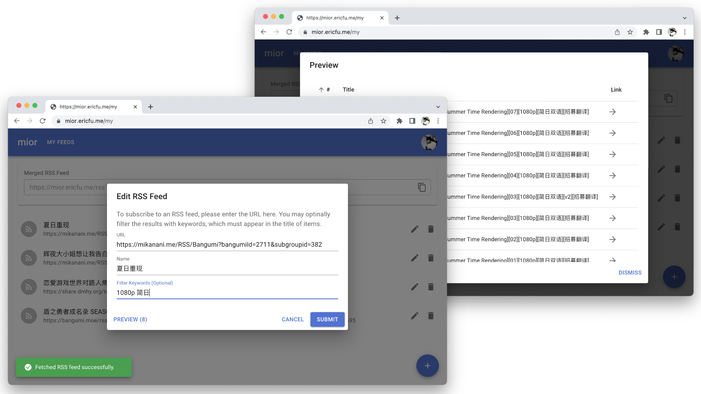

# mior

_Merge into one RSS_

[](https://github.com/fuyufjh/mior/actions/workflows/ci.yml)
[](https://github.com/fuyufjh/mior/blob/main/LICENSE)

***mior*** is a lightweight web service to filter and merge multiple RSS feeds into one. It provides a pure web-based,
responsive user interface to manage the upstream feed sources. A merged RSS is provided to user to
fetch the merged results, which gathers all filtered items in upstream feeds.



## Development Guide

### Frontend

The frontend is built with [Next.js](https://nextjs.org/) and [MUI](https://mui.com/zh/), and uses [Yarn](https://yarnpkg.com/) as its package manager.
We recommend installing Node.js with [fnm](https://github.com/Schniz/fnm) (Fast Node Manager).

```bash
curl -fsSL https://fnm.vercel.app/install | bash
```

Install Node.js and Yarn package manager.

```bash
cd frontend/
fnm install
npm install -g yarn
```

Install dependencies and start dev server.

```bash
yarn install
yarn dev
```

To build into static HTMLs:

```bash
yarn build
```

### Backend

The backend server is developed with [Rust](https://www.rust-lang.org/) language and [Rocket](https://rocket.rs/) web framework.
If this is your first time to build Rust projects, please install [rustup](https://rustup.rs/) and it will
set up all the environment automatically.

```bash
curl --proto '=https' --tlsv1.2 -sSf https://sh.rustup.rs | sh
```

Additionally, openssl library is required by Rocket. 

```bash
# On macOS
brew install openssl

# On Debian/Ubuntu
sudo apt-get -y install pkg-config libssl-dev
```

Compile and start up the server:

```bash
cargo run
```

To build into binary in release mode:

```bash
cargo build --release
```

### Notes on Local Debug

By default, the backend server listens on http://localhost:8000 and the frontend (Next.js dev server) listens 
on http://localhost:3000, but the Next.js dev server has been configured to redirect API requests to the backend (see [next.config.js](next.config.js)). 

In practice, we recommend you to debug from the http://localhost:3000 in order to take advantage of the
[Fast Refresh](https://nextjs.org/docs/basic-features/fast-refresh) feature of Next.js.
